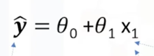
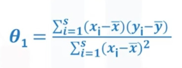
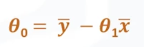
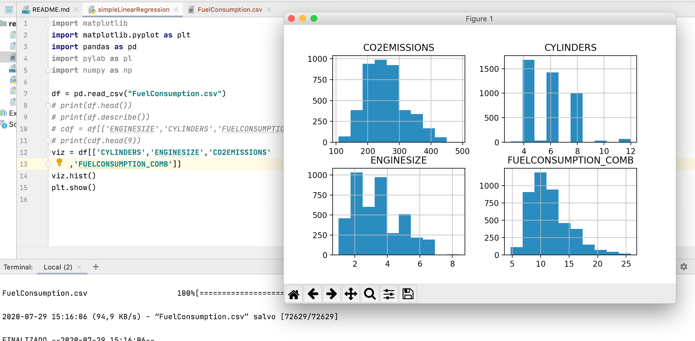
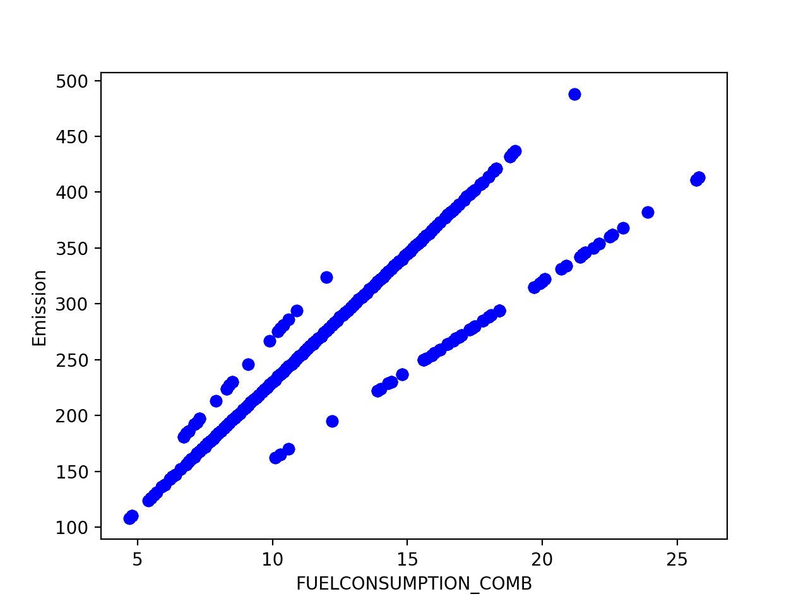
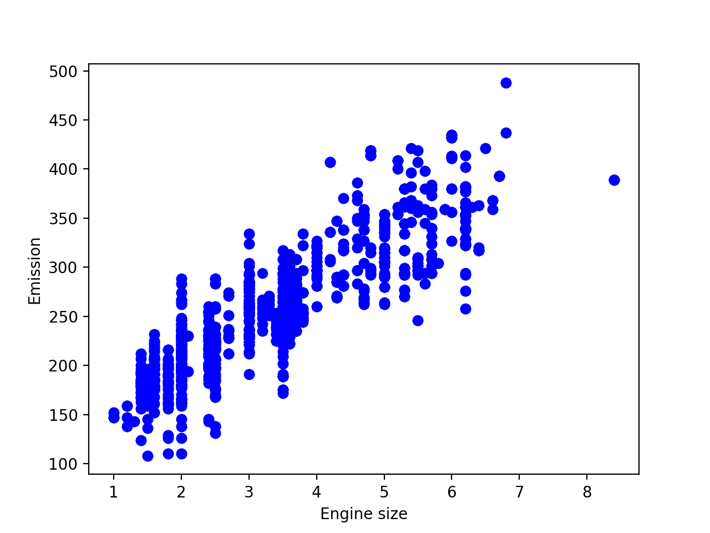
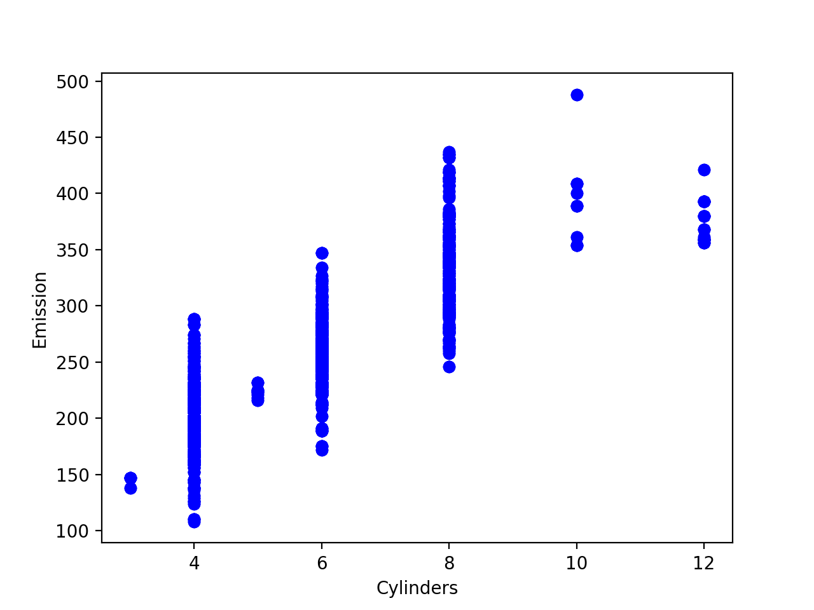
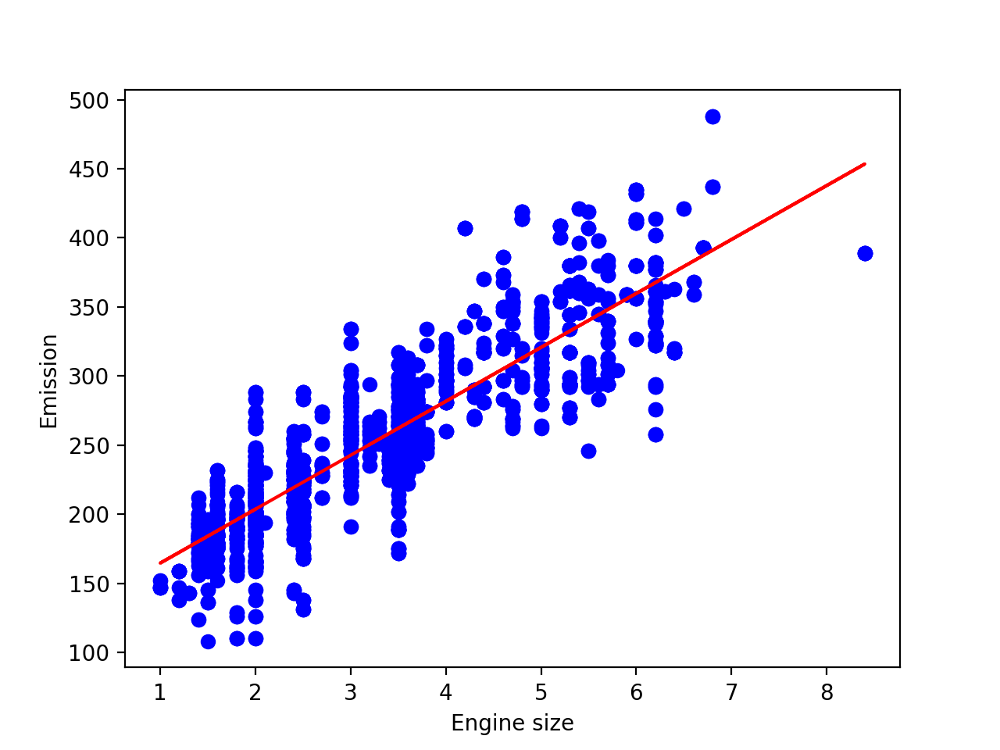
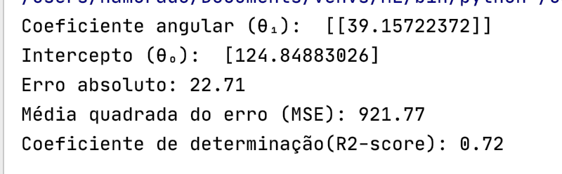

# Regressão Linear Simples

## Objetivo
Esse repositório tem como objetivo guiar um estudo em machine learning em português, o conteúdo desse repositório foi baseaod no curso de Machine Learning da IBM, no livro An Introduction to Machine Learning (*Miroslav Kubat*) e no livro Introduction to Statistics and Data Analysis (*Christian Heumann and Michael Schomaker Shalabh*). Neste módulo estudaremos a Regressão Linear Simples.

## Regressão Linear Simples, o que é, aonde vive do que se alimenta? :trollface: 
### Regressão
Regressão é o processo de prever um valor contínuo.
Nesse caso, uma variavel independente (geralmente chamada de X) causa algum efeito em uma variável dependente (geralmente chamada de Y).
Ok, ainda parece um bocado confuso, vamos ver alguns exemplos:
- Temperatura na praia (X) VS Taxa de ocupação de hotéis no litoral (Y)
- Altura de uma pessoa (X) VS Peso de uma pessoa (Y)
### O modelo Linear

A figura acima nos mostra uma associação linear positiva entre X e Y: Quanto maior o valor de X, maior será o valor de Y (e vice-versa), caso esse modelos e referisse ao nosso exemplo da praia, quanto maior a temperatura na praia, maior seria a taxa de ocupação dos hotéis.

### Fórmula e quem é quem nessa bagunça



- Y => Nosso amigo Y de chapéu :womans_hat:, é a nossa variável dependente, para encontrarmos o valor dela, dependemos do valor de outra variável que existe independente de Y. No nosso caso, faz calor ou frio na praia (variável X), independente da taxa de ocupacão dos hotéis, mas é inegável que existe uma correlação entre estar calor e os hotéis na praia estarem lotados.

- X₁ => Nosso amigo X₁ é a variável independente, ela é fundamental para chegarmos no valor de Y:womans_hat:, como visto acima, no nosso exemplo X₁ seria a temperatura na praia em um determinado dia.

- θ₁ => O têta 1 é o coeficiente angular (Slope ou gradiant), e é representado pela fórmula abaixo:

- Onde o X com aquela barrinha maneira em cima é a média dos valores da variável independente, e obviamente o Y com a barrinha maneira é a média dos valores da variável dependente Y
- E nosso amigo X com o izinho pequenino signifca que temos que repetir a conta para cada valor do eixo X, o mesmo vale para o Yi.

-  θ₀ =>  O têta zero é o Intercepto (intercept), é representado pela fórmula abaixo:   

- Agora ficou bem fácil calcular o nosso intercepto não é mesmo? 

### Tá bom e o que eu e o python temos a ver com isso? 
Agora vamos aprender como utilizar o scikit-learn no Python para implementar uma regressão linear simples, dado um banco de dados. Nesse caso utilizaremos dados relacionados com consumo de combustível e emissão de CO2 em veículos. Depois vamos utlizar training and test sets (vamos explicar mais a frente), criaremos um modelo usando um training set, e finalmente seremos capazes de usar esse modelo para prever um valor desconhecido.

### Bora fazendo! 
#### Primeiro vamos importar todos os pacotes que precisamos

`import matplotlib.pyplot as plt`

`import pandas as pd`

`import pylab as pl`

`import numpy as np`

`from sklearn import linear_model`

`from sklearn.metrics import r2_score`

#### Agora vamos plotar nosso primeiro gráfico 
```python
df = pd.read_csv("FuelConsumption.csv")
cdf = df[['ENGINESIZE','CYLINDERS','FUELCONSUMPTION_COMB','CO2EMISSIONS']]`
viz = cdf[['CYLINDERS','ENGINESIZE','CO2EMISSIONS','FUELCONSUMPTION_COMB']]`
viz.hist()
plt.show()
```

Esse trecho de código salva em uma variavel (cdf) os parametros que vamos utilizar, tais como tamanho do motor, cilinidradas, consumo de combustível e emissões de co2, e plota em um gráfico conforme imagem abaixo


#### Agora vamos ao que interessa:
##### Podemos plotar cada um desses parametros em comparação com a emissão para avaliar a linearidade dessas relações
###### Consumo de combustível vs Emissões de CO2

```python
plt.scatter(cdf.FUELCONSUMPTION_COMB, cdf.CO2EMISSIONS,  color='blue')
plt.xlabel("FUELCONSUMPTION_COMB")
plt.ylabel("Emission")
plt.show()
```



###### Tamanho motor vs Emissões de CO2

```python
plt.scatter(cdf.ENGINESIZE, cdf.CO2EMISSIONS,  color='blue')
plt.xlabel("Engine size")
plt.ylabel("Emission")
plt.show()
```



###### Cilindradas vs Emissões de CO2
```python
plt.scatter(cdf.CYLINDERS, cdf.CO2EMISSIONS, color='blue')
plt.xlabel("Cylinders")
plt.ylabel("Emission")
plt.show()
```


#### Vamos criar o treinamento e teste

Para isso vamos dividir nosso conjunto de dados em treinamento e teste, depois iremos testar com o conjunto de testes, e treinar com o conjunto de treinamento, com isso temos mais precisão na hora de avaliar os resultados, isso porque o conjunto de dados de teste não faz parte do conjunto de dados que foi usado para treinar os dados, desse modo fica mais realista para problemas reais.
Isso significa que sabemos o resultado de cada ponto de dados nesse conjunto, o que é ótimo para testar! E como esses dados não foram usados para treinar o modelo, o modelo não tem conhecimento do resultado desses pontos de dados. Portanto, em essência, é realmente um teste fora da amostra.
Vamos dividir nosso conjunto de dados em conjuntos de treinamento e teste, 80% de todos os dados para treinamento e 20% para teste. Criamos uma máscara para selecionar linhas aleatórias usando a função np.random.rand, conforme vemos no código abaixo
```python
msk = np.random.rand(len(df)) < 0.8
train = cdf[msk]
test = cdf[~msk]
```

#### O modelo de regressão simples
##### Distribuição de dados para treinamento
A regressão linear se ajusta a um modelo linear com coeficientes 𝜃=(𝜃1,...,𝜃𝑛) para minimizar a 'soma residual dos quadrados' entre o x independente no conjunto de dados e o dependente y pela aproximação linear.

```python
plt.scatter(train.ENGINESIZE, train.CO2EMISSIONS,  color='blue')
plt.xlabel("Engine size")
plt.ylabel("Emission")
plt.show()
```
##### Modelando os dados
Como mencionado anteriormente,(mais uma vez, não parece tão complicado assim né?) Coeficiente e Intercepto na regressão linear simples, são os parâmetros da linha de ajuste. Dado que é uma regressão linear simples, com apenas 2 parâmetros, e sabendo que os parâmetros são a interceptação e a inclinação da linha, o sklearn pode calculá-los diretamente de nossos dados. Observe que todos os dados devem estar disponíveis para percorrer e calcular os parâmetros.

```python

regr = linear_model.LinearRegression()
train_x = np.asanyarray(train[['ENGINESIZE']])
train_y = np.asanyarray(train[['CO2EMISSIONS']])
regr.fit (train_x, train_y)

# Calculando coeficientes..
print ('Coeficiente angular (θ₁): ', regr.coef_)
print ('Intercepto (θ₀): ',regr.intercept_)
```
Agora podemos plotar nossa linha no parametro desejado :)
```python

plt.scatter(train.ENGINESIZE, train.CO2EMISSIONS,  color='blue')
plt.plot(train_x, regr.coef_[0][0]*train_x + regr.intercept_[0], '-r')
plt.xlabel("Engine size")
plt.ylabel("Emission")
plt.show()
```



##### Avaliação do modelo
Vamos usar o Erro médio quadrático ou MSE: Que é a média do erro quadrático. É mais popular que o erro absoluto médio, porque o foco é mais voltado para erros grandes. Isso ocorre porque o termo ao quadrado aumenta exponencialmente os erros maiores em comparação com os menores.
```python

test_x = np.asanyarray(test[['ENGINESIZE']])
test_y = np.asanyarray(test[['CO2EMISSIONS']])
test_y_hat = regr.predict(test_x)

print("Erro absoluto: %.2f" % np.mean(np.absolute(test_y_hat - test_y)))
print("Média quadrada do erro (MSE): %.2f" % np.mean((test_y_hat - test_y) ** 2))
print("Coeficiente de determinação(R2-score): %.2f" % r2_score(test_y_hat , test_y) )
```


